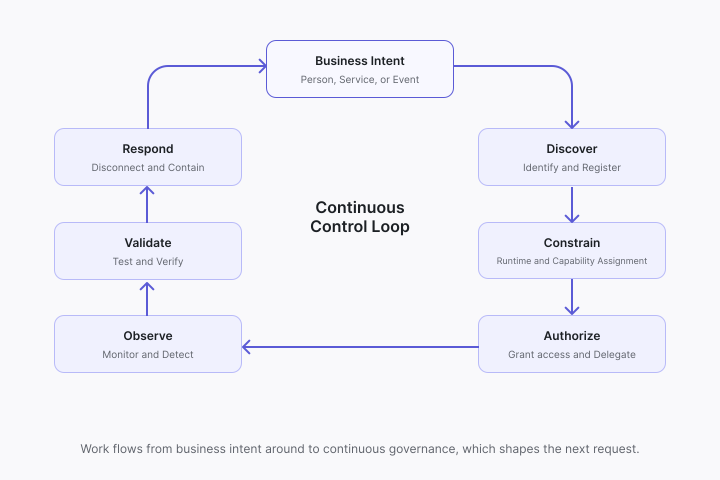
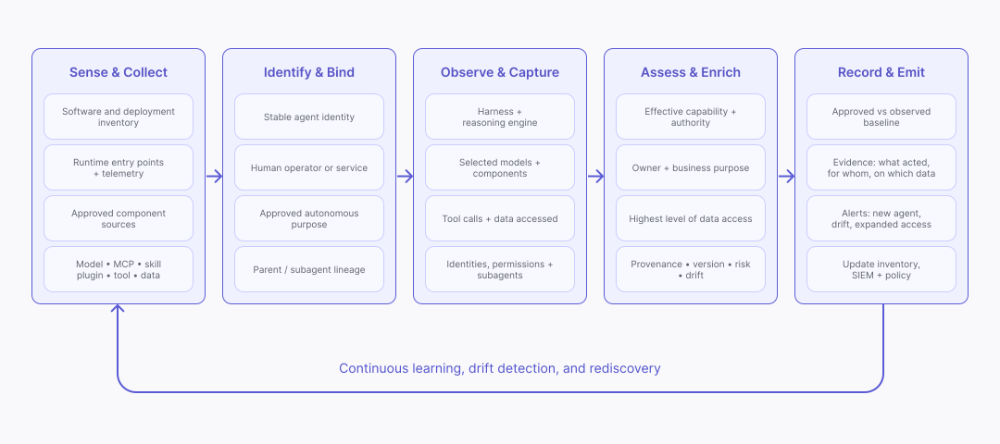
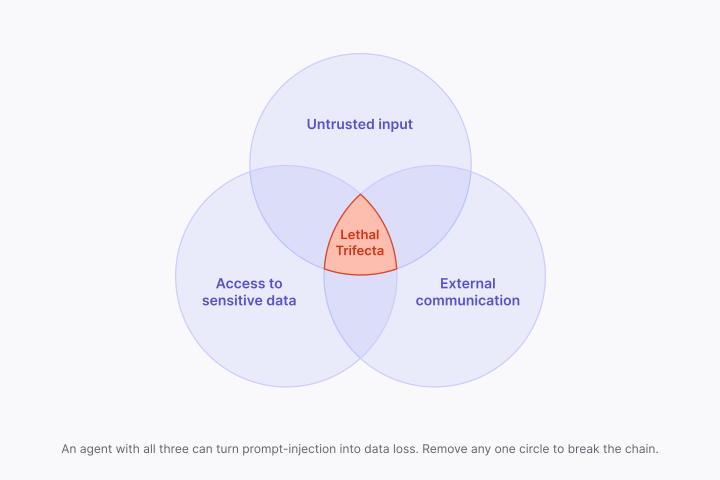
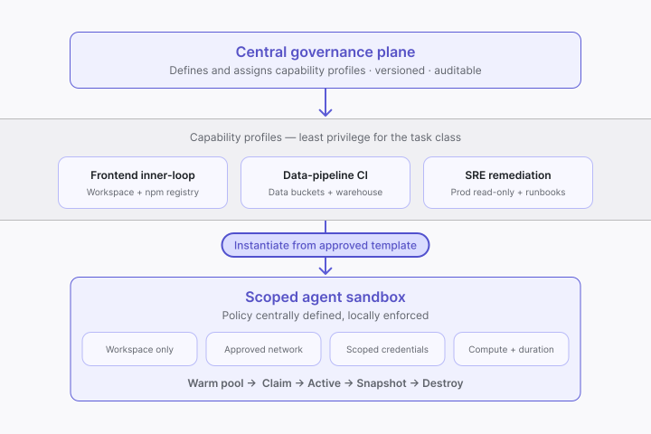
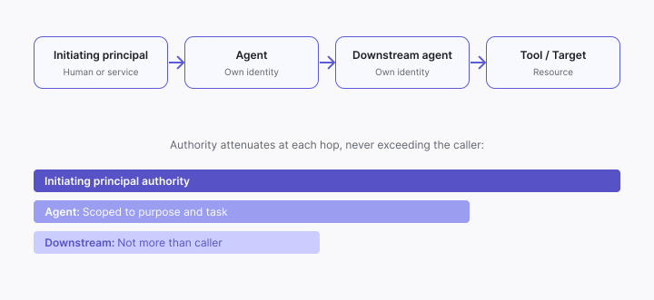
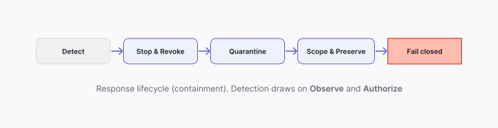

# Six security outcomes for safely building, deploying and operating AI agents

Identify the agent. Bound its authority. Control its actions. Prove its outcomes.

Published as **Agent Baseline** · v1.0-draft · 30 July 2026 · agentbaseline.org  
Draft for public comment until 30 September 2026.

# Executive summary

AI agents are on the CISO's agenda, ready or not. CEOs and CTOs are pushing agentic tools across their organizations, often on timelines that leave little room to plan. Security is frequently the last to know, brought in only after an agent already has access to sensitive data or production systems. That leaves the CISO with an uncomfortable choice. Allow adoption without the right controls and take on risk no one fully understands, or block it and become the obstacle to a priority the business has already decided on, while adoption continues quietly in the shadows either way. The real job is neither. It is to help the organization move fast without losing control.

An AI agent is fundamentally different from traditional enterprise software. End users can reprogram it at runtime, in plain language, changing what it does and how it uses tools and data with no development or release cycle in between. We are not provisioning a fixed-function software, we are provisioning a nondeterministic actor, one that can reach sensitive data, call tools, assume user identity and act faster than we can respond. A mistaken or malicious instruction can become a harmful action before anyone can step in. Existing controls still matter, but they were not built for this mix of runtime programmability, access and autonomy.

The market does not make this easier. Go looking for help and you run into a fog of AI marketing, where a phrase like "agent governance" can mean almost anything. Each product solves a real piece of the problem. What is rarely clear is which piece, or how the pieces are meant to fit together. This paper cuts through the fog by defining the blueprint not by product category but by the security outcomes an enterprise has to achieve: Discover, Constrain, Authorize, Observe, Validate and Respond. These are not six separate checkpoints but one continuous loop, each a stage that work passes through from business intent to evidence and governance, and back to the next request.

This baseline fills a gap that existing guidance leaves open. Threat lists and risk frameworks describe what can go wrong and how to govern it, but not which capabilities an enterprise needs in place, or how to judge whether the products it has assembled work together end to end. Map any agent platform, product or internal build against the six outcomes and the gaps become visible.

Security is one outcome of getting it right, but the larger purpose is enabling the enterprise to operationalize AI safely. The six outcomes described here define the operating layer that translates business intent into governed autonomous action. Their concerns of identity, capability, authority, evidence and containment belong as much to the CIO, the CTO, platform engineering and governance teams as they do to the CISO, because they decide not just whether agents are safe but whether the organization can delegate real work to them at all.

# Contents {#contents}

[Executive summary](#executive-summary)

[Contents](#contents)

[Introduction](#introduction)

[What we mean by an AI agent](#what-we-mean-by-an-ai-agent)

[The six outcomes](#six-outcome)

[Discover](#discover)

[Constrain](#constrain)

[Authorize](#authorize)

[Observe](#observe)

[Validate](#validate)

[Respond](#respond)

[Worked example: climbing the autonomy curve](#worked-example:-climbing-the-autonomy-curve)

[The same useful action with less supervision](#the-same-useful-action-with-less-supervision)

[Stage 1: Third-party desktop and coding agents](#stage-1:-third-party-desktop-and-coding-agents)

[Stage 2: The background coding agent and the decay of intent](#stage-2:-the-background-coding-agent-and-the-decay-of-intent)

[Stage 3: The deployed agent and the delegation problem](#stage-3:-the-deployed-agent-and-the-delegation-problem)

[Stage 4: autonomous operation and the ability to say “stop”](#stage-4-saying-stop)

[Conclusion](#conclusion)

[Appendix A. Canonical capability map](#appendix-a.-canonical-capability-map)

# Introduction

## What we mean by an AI agent {#what-we-mean-by-an-ai-agent}

A language model (LM) is not, by itself, an agent. An AI agent is a software system that receives a goal or instruction, uses a model to determine how to pursue it, and can act through tools or connected systems. Unlike most enterprise software, its effective behaviour is not fully defined before deployment. It is programmed at runtime by the content it processes: user instructions, tool results, retrieved documents, memory or component descriptions. 

An agent is also an actor, and in most deployments today it is an actor with no identity of its own. It assumes the identity of an existing user: it authenticates with that person's credentials, inherits their sessions and permissions, and every system it touches records its actions as that person's. Anything the user can read, change or delete, the agent can too.

Because the model cannot reliably distinguish the initiating principal's instructions from instructions embedded in that content, any party able to influence the agent's inputs, including an external attacker, can alter what the agent does and, through the identity it has assumed, act as that user.

Controlling this risk requires governing the full path from intent to outcome. The capabilities described in this paper do not attempt to control how the model reasons. Instead, they establish the controls and evidence needed to ensure that agent execution remains trustworthy throughout that path.

No single enforcement point can deliver this control system. The required controls are spread across identity, data, runtime, tools, applications, transactions, observability and evidence systems, but they must work together as one end-to-end path from intent to outcome. Shared context and control identifiers connect these systems and allow decisions and evidence to follow the agent throughout its execution. A product may implement one or more parts of this architecture, but all six outcomes must be addressed to provide end-to-end control.

| Outcome | Requirement | Evidence of achievement |
| :---- | :---- | :---- |
| 1\. Discover | Discover every agent and its dependencies. | Authoritative inventory reconciled with observed code, cloud, endpoint, identity, SaaS and runtime evidence. |
| 2\. Constrain | Enforce which agents and components may run and what capabilities they have. | Blocked unapproved releases and components, agent capabilities constrained. |
| 3\. Authorize | Authorize the agent's purpose, identity and delegated authority. | Attributable identity and a purpose-, task-, resource-, action- and time-bound delegation context. |
| 4\. Observe | Observe every material decision, action and dependency. | Correlated telemetry that joins intent, actor, task, policy, action, target, outcome and cost. |
| 5\. Validate | Test agents, components and generated artifacts against relevant threats. | Tested agents and first-party components, verified third-party agents and components, and tested agent-produced artifacts. |
| 6\. Respond | Stop, revoke, quarantine and contain unsafe agent activity. | Tested circuit breakers, revocation, quarantine, escalation, evidence preservation and impact scoping. |

# The six outcomes {#six-outcome}

The six outcomes are not an exhaustive list of controls. They are the baseline architectural coverage test because together they answer three questions: 

* What is operating, with what capabilities? 

* Is it staying inside approved boundaries? 

* Can you prove what happened and stop it?

Discover, Constrain, Authorize, Observe, Validate and Respond cover that full path from business intent to action, evidence and containment. A product may implement one or more components, but end-to-end governance requires all six outcomes to be addressed through an integrated architecture.

These outcomes do not rely on the agent always following the rules it is given. Instead, the architecture enforces boundaries outside the model, limits the authority delegated to the agent, and detects and responds when a permitted action causes harm. These controls are useful today and will become stronger as interpretability and behavioural evaluation improve. Together, the six provide a sustainable way to move up the autonomy curve: enough control to delegate real work, and enough evidence to detect when something has gone wrong and stop it.

## Discover {#discover}

Discovery has to solve two different problems. First, an agent or component does not always appear as a distinct software artifact. It can be expressed as configuration, a setting inside an approved product or an ordinary file whose role depends on where it is placed and how it is loaded. A Markdown file can be documentation in one directory and an agent skill in another. File type and name alone do not reveal what it is.

Second, finding the persistent definition does not reveal the agent that actually runs. Its capabilities emerge from the combination of its harness, reasoning engine and accessible data. A user can connect a new model, MCP server, skill, plugin, tool or data source at runtime without creating a new application, package, endpoint or deployment. The visible shell stays the same while what the agent can do changes.

To put this in perspective, imagine trying to catalogue every skill your employees have while they learn complex new tasks each day and can call on a specialist at any time for a specific job. We cannot do that for people, but we need a way to do it for agents because they are not subject to the same constraints of ethical judgement and personal accountability.

Neither problem is solved by making Security the census-taker. The workable model inverts the usual accountability: the business registers and owns its agents, and Security writes the criteria that say which agents must be registered, when, and what the record contains. Observation stays universal. Registration does not need to, so long as the threshold is explicit and set by risk: an unregistered agent below it is accepted risk, one above it is a finding for discovery to surface. The threshold also polices itself. Registration is how an agent reaches the valuable parts of the organization, so an agent that stays unregistered stays confined to low-value access.

### What to do

Build discovery at two layers. At rest, inspect the locations and settings that agent products use to load instructions, skills, plugins, MCP servers, models and data sources. Interpret each file in that context: a Markdown file in a registered skill directory is an agent component, even though the same file elsewhere may be documentation. Give every agent definition and deployment a stable identity. Where the agent meets the registration criteria, the accountable business owner creates that record and names the business and technical owners and the agent's purpose.

At execution time, link each run to that identity and to the human operator, service or approved autonomous purpose that initiated it. Observe the models and components selected, tools called, data accessed, identities used and subagents created. Use this evidence to establish the agent's effective capabilities, ownership, risk and highest level of data access. Tying access to registration keeps this link reliable and makes registering the easy path: a registered agent receives brokered credentials and approved connections, an unregistered one receives nothing (see Stage 1 of the worked example).

Extend existing code, endpoint, cloud and SaaS discovery rather than building a separate inventory system. Teach those systems where agent products keep their configuration and components, and reconcile what they find against registrations, approved repositories and component records. Keep learning from runtime activity so new agents, capability drift, expanded access and unexpected behaviour become visible without reconstructing events from disconnected logs. The result is not a static registry but a continuously reconciled operational view that can answer, at any time, what is running, what has changed and what authority each agent currently holds.

Reference capabilities: DIS-01–07 in Appendix A

## Constrain {#constrain}

### Composition

Discovering agents and their components is only the first step. The next questions are whether each is safe to use and what risks arise when the agent’s components are combined with everything else the agent can reach.

Most existing supply-chain controls still apply. A skill is a Markdown file, so it can be versioned, reviewed and merged like any other source code. What is different for agents is how that skill becomes available for use. In many agent products, copying the file into a skill directory is enough. Because there is no deployment or installation event, the usual admission gate never runs.

Checking components one by one misses another class of risk. A tool with no known vulnerability can still complete a path from untrusted input to sensitive data, external communication or destructive action. The danger comes from the combination. The “lethal trifecta” is one example.

Discovery establishes which components exist and where they are used. Supply-chain and composition capabilities determine which components may be used, how they may be connected, and whether agents can introduce unapproved components at runtime.

### Composition: What to do

Keep using approved repositories, versioning, signatures and scanning. Add an admission check wherever a component can become available to an agent, including local directories, plugin installation, MCP connections and runtime selection. A file or configuration entry being present does not make it approved.

Record exactly what was approved: source, version or integrity reference, permissions, endpoints and intended role. Check that record again when the agent loads the component. Block anything unknown or changed until it has been assessed. When a managed provider does not expose an immutable version, require another reliable signal that it has changed and limit what it can reach and do.

Reference capabilities: CON-01–02 Appendix A

### Runtime isolation

An agent does not just reason. It runs code, installs packages, calls tools and starts processes. Run it inside a developer's environment or a general-purpose CI runner and it inherits whatever that host can reach: the filesystem, the credentials sitting on disk, the network. The obvious danger is blast radius, where a wrong or malicious instruction executes with the reach of the host instead of the reach the task needed. An agent plans around what it can see, so the moment it has more capability than the task calls for, it starts to use it, reaching for files, credentials and connections the job never required. Over-provisioning does not just make a failure bigger; it changes what the agent decides to do.

For ordinary software, arbitrary code running outside policy is a compromise; for an agent it is how the work gets done, written and run at runtime and steered by content you do not control. Per-command approval does not help, because it sees the command, not what the generated code will touch once it runs. This is where control is usually lost: a registry and an approval workflow achieve nothing if the agent runs on a host that enforces neither. The boundary is also harder to hold than a normal workload's, because the run moves, from a laptop to a vendor workspace to your cloud, so policy must travel with the task or risk settles wherever enforcement is weakest. And unlike a fixed sandbox, an agent keeps asking the user for more access as it works, so a boundary that slows everyday work gets clicked away one "always allow" at a time.

Two things need special care, both at the edges of the boundary. Egress is where data theft is decided, since an attack only succeeds if the data can leave, and agent egress is harder than conventional data-loss control because the legitimate destinations cannot be listed in advance: a service's are fixed, but an agent's are chosen by the same runtime planning an attacker can steer, and its work channels, package installs, git pushes, webhooks and APIs, are the very channels stolen data would use, with covert paths like DNS alongside them. Egress must therefore be scoped to the task, not the workload. The other edge is what the agent creates, not only what it loads: untrusted content steers the model, the model writes code, and the code acts, laundering an instruction into behaviour no input filter ever saw. Inside the sandbox that is tolerable, since it runs with only the task's authority; the risk concentrates at the exit, where a commit, package or deployment carries it into systems the sandbox no longer controls.

Reference capabilities: CON-03–04 Appendix A

### Runtime isolation: What to do

Run each agent task in a sandbox that exposes only what its class of work needs, not everything on the host. Those limits come from a capability profile, defined centrally for each team or use case. An agent runs under its assigned profile or not at all, it cannot pick or edit one for itself. Control who may use each profile too, or teams drift toward the broadest one over time. When a task needs more than its profile allows, grant the extra scope just-in-time, through a mediated and audited request the agent cannot issue to itself.

Provision each sandbox from an approved template that applies the profile and the run identity, and treat the environment as disposable. Keep a pool of ready environments so the approved path stays fast. Snapshot state when evidence or resumption calls for it, then reset or destroy the environment at completion so nothing left behind reaches the next task. Those snapshots are also what Respond relies on when a run has to be investigated.

Define the profile’s limits centrally, preferably as versioned code, and enforce them at the sandbox boundary, outside the model and outside the agent’s reach. Neither the agent nor an ordinary user should be able to weaken the policy, and enforcement should fail closed when the policy source cannot be verified. Apply the same policy contract wherever the task happens to run, local or remote, even where the enforcement mechanics differ. Tie every enforcement decision and boundary event back to the initiating user and task.

Deny network egress by default and allow only the destinations the profile approves, indirect channels included. Deliver credentials through a broker at the moment of use rather than leaving them in the workspace, so an injected instruction finds no secret to steal and no open route to send it through. Log blocked attempts against the run; they are among the earliest signals of a poisoned input.

Let agent-generated code and tools execute freely inside the boundary, and control the exits instead. An artifact leaves the sandbox only through the same release gates as human-produced changes, with testing automated enough to keep pace with how fast agents produce them. Anything an agent introduces at runtime gets checked against the approved record before use, as described under Composition.

Reference capabilities: CON-03 Appendix A

## Authorize {#authorize}

Traditional access models start from a fairly clear contract: a known human or service authenticates, and its activity can be understood within a recognisable session and purpose. Agents weaken that assumption because they operate autonomously across longer lifecycles and can reuse existing access after the original task or reason has changed. The question is no longer only which account made the call, but which agent and deployed instance acted, which person or approved purpose set it in motion, and why. Shared credentials blur those users, agents and tasks into a single identity that the target system cannot untangle.

Identity alone does not bound what an agent may do. An account's permissions stand: granted once, they hold between tasks, belong to no particular one, and nothing asks why at the moment of use. Authority does not: it is delegated for a purpose, scoped to a task, its resources and its limits, and it expires when the work does. 

Standing permissions may legitimately exist in the systems an agent touches, but an agent that exercises them directly wields everything the account can do, not what the task requires. A narrow task then runs under broad standing access, and that access passes unchanged to every subagent: the chain has no technical expression of the task boundary. If one agent acts incorrectly, the scale of failure is set by the inherited permissions, not by the authority the work needed.

### What to do

Give every party to an action a distinct, verifiable identity. The agent authenticates as itself, the initiating human or service authenticates as itself and each downstream agent keeps its own identity. Join them for the specific run, task and time through a delegation context. For event-driven work, use a named autonomous purpose and accountable owner instead of pretending that a person was present.

Keep existing identity providers as the source of truth. The agent identity and authorization layer adds the agent, deployment, run, task and delegation context that conventional authentication events do not carry. Verification rests on that identity and attested run context, not on a reusable credential stored by the agent.

Delegate authority for each material action rather than letting the agent exercise standing permissions directly, even narrow ones. Least privilege bounds how much access exists. Delegation bounds why, for what and for how long it may be used. Removing standing access does not remove the configuration: a group of agents can still be assigned access to a system, but the assignment becomes eligibility rather than possession. Each use is requested and re-evaluated at the moment of action, under conditions that must hold then rather than when the assignment was made. 

Bind each decision to the initiating principal or approved autonomous purpose and the task at hand. The form of the grant depends on what the target system supports: a credential that lives only as long as the action, a capability token or permit signed for that action, an identity that exists only for the run, or a policy decision enforced in line with no artifact at all. The bound comes from the delegation decision, not from the lifetime of whatever carries it. Where the grant produces a token or credential, issue it only after the decision and keep it out of model context, memory and the agent's workspace.

Preserve both identity and authority when an agent delegates. Record the calling agent, receiving agent and authority passed while keeping the originating principal or autonomous purpose unchanged. The receiving agent may get less authority than the caller, but never more. The same enforcement point that permits an action must also be able to deny or halt it when identity, context, approval or behaviour changes.

Reference capabilities: AUT-01-09 Appendix A

## Observe {#observe}

Agent behavior is nondeterministic and can change as models, tools and operating context evolve. Preventive controls reduce risk but do not eliminate it. Malicious input, user error, agent failure or misalignment can cause harmful actions within permitted boundaries. Misalignment is the hardest of these to catch, because the agent is not malfunctioning: it is competently pursuing an objective that has diverged from the intent it was given, so every individual action can look legitimate. Whether an action is acceptable depends not only on authorization but on the task and circumstances in which it occurs.

Traditional observability provides only part of this context. A downstream system may record an API call by a service account without showing that it belonged to a particular agent task or whether the user explicitly consented to it. Each event can look normal on its own while the run as a whole drifts away from its intended purpose.

An agent workflow does not leave one audit record. It leaves fragments across the agent runtime, identity and policy systems, tools, applications and the systems that were changed. Delegation can bring new systems into the run as it unfolds. By the time the work finishes, those events may be scattered, briefly retained or impossible to tie back to the same task. A successful result does not show that the route taken was authorized or safe.

Integrity alone does not solve this. A signature can show that one record has not changed, but it cannot reveal a missing event or reconnect a broken sequence. Richer evidence also creates exposure of its own because prompts, responses and tool results can contain credentials, personal data and corporate secrets.

Two related but distinct responsibilities follow. Operational observability tells operators what is happening, in time to spot failure, compromise or misalignment while it can still be stopped. Governance evidence proves what happened, to a standard that survives investigation, audit and challenge after the fact. They share telemetry but have different consumers, retention and completeness requirements, and an architecture that delivers one does not automatically deliver the other.

### What to do

Instrument the agent runtime so its telemetry connects the request that started a run to the decisions it made and the result recorded by the target system. Establish a behavioural baseline for that work so unexpected resource use or capability changes stand out as possible failure or compromise.

Give every run a stable correlation identifier and define a common evidence contract for the systems that participate in it: each system must emit enough standardized evidence to reconstruct the delegated authority it exercised, the policy decisions that governed it, the actions it executed and the business outcome that resulted. This makes evidence an architectural interface a system implements to participate in agent workflows, not a logging convention. Use that contract to assemble the whole run into one timeline. The record should preserve the agents involved, the authority they received and the decisions that changed the course of the run, so an investigator can understand what happened without replaying disconnected logs.

Store and correlate this evidence centrally enough to detect missing links and preserve its sequence and integrity. Collect only the content needed for investigation, redact sensitive values and set access and retention according to the evidence's sensitivity.

Feed the resulting record into existing SIEM, audit and GRC platforms rather than replacing them. Where a system cannot emit the required context, record the gap explicitly instead of implying that the account is complete.

Reference capabilities: OBS-01-06 Appendix A

## Validate {#validate}

Conventional secure-development tools were not designed for agentic systems. Agents introduce new risks, including prompt injection, model misalignment and non-deterministic behaviour. An agent may behave safely in one context, then act differently when exposed to malicious instructions or unexpected inputs.

Agentic components create a similar challenge. Prompts, skills and tool definitions are often written in natural language rather than code, placing them outside the scope of static analysis tools designed for conventional software.

The artifacts produced by agents also need to be secured. Agent-generated applications, code and configuration can contain vulnerabilities just like human-produced software. Agents may avoid some obvious flaws, but complex business-logic issues can still slip through traditional security testing. The difference is that these artifacts can now be produced at unprecedented speed and scale.

Technical success does not guarantee a correct business outcome. An agent may complete an action successfully while still misunderstanding the user’s intent, violating business rules or producing a semantically incorrect result.

### What to do

Test agents as end-to-end systems against agent-specific attack paths, including prompt injection. Run these tests in a sandbox where possible, using execution traces to identify unsafe behaviour. Include them in pre-release evaluations and continue testing after deployment as the agent, its tools and its operating context change.

Apply security testing to each agentic component. Use methods suited to the component, such as analysing prompts and skills for malicious instructions, and testing models for jailbreaks or misalignment. Define security requirements for internally developed components and verify them with targeted tests. For example, detect when a skill is changed in a way that gives the agent unsafe access to production systems.

Validate all agent-generated code, configuration and other artifacts before they are accepted or deployed. Test them for conventional software vulnerabilities, while also using methods that can detect complex business-logic and authorization flaws.

Validate the business outcomes and outputs of agent actions after they are completed, using automated checks where possible and human review where necessary. For high-impact or irreversible actions, also validate the proposed outcome before it is finalized. To make automated validation feasible, use a combination of deterministic rules and AI-based validation.

Reference capabilities: VAL-01-04 Appendix A

## Respond {#respond}

When an agent goes wrong, the response window is shorter than the normal human incident cycle. An agent does not act at raw machine speed: each step still waits for model inference and tool execution. Its advantage is how quickly it can interpret noisy results, recognise useful patterns and choose the next action. Work that takes a person minutes or hours can take an agent seconds, allowing a harmful run to adapt before an operator understands what is happening.

Containment must do more than terminate the visible process. If an agent has been tricked into exfiltrating data with a legitimately issued token, deleting its container does nothing while that token, its delegated grants and its live sessions still work elsewhere. Response must stop new work and invalidate the active credentials, permits, grants and sessions within a window set by the worst-case impact.

The unit of quarantine changes as well. Traditional response isolates a host, disables an account or blocks a file hash. With agents, the harmful element is often a component: a poisoned skill file, a compromised MCP server, a model version that mishandles instructions. That component can be shared by many agents, and because making it available can be as simple as placing a file in a directory, removing one copy does not remove it. Containment has to block the component everywhere it appears and prevent it from being loaded again.

Not every unsafe signal calls for containment. An agent plans around what it can see, and a policy denial is part of what it sees. A denial that carries only "no" invites retries and workarounds, while one that carries the reason and the governed path forward, register the component, request a scoped elevation with a justification, obtain independent approval or step-up verification, steers the run back inside its boundaries without ending it. This steering has a deliberately narrow remit: it communicates security requirements the architecture already enforces, and it does not direct the agent's task or reshape its output. Between a steer and a full stop sits a further option, reducing the run's capability profile or delegated authority in place so work continues with less reach while a person decides. Stop, revocation and quarantine remain the answer whenever a steer would leave unacceptable risk in play, but reaching for them first turns every anomaly into an outage.

Depending on automation for essential work is not a new problem. What changes is that reliance on these flows makes the agent less like a system and more like a worker: the ability to do the work sits with the agent, not with the platform it happens to run on. When that platform is compromised, or a response revokes an agent's authority or quarantines a component that many workflows share, stopping the agent strands the work. The harder problem is moving the agent to a clean platform and governing how its identity, delegated authority and permissions migrate with it, automatically and without carrying the compromise across. That migration path, and the deterministic fallback, pre-agent automation or a documented manual procedure, for work that cannot wait for it, are decisions to make before the incident, not during it.

### What to do

Respond in grades, and treat stop as the last grade rather than the first. Make enforcement-point denials informative: return the policy reason and the governed remediation path, such as registering an unapproved component, requesting just-in-time elevation with a justification, or routing the action for independent approval or step-up verification, so the run can correct course on its own. Keep these signals to security requirements only, never task direction. Where a steer is not enough but a stop is premature, reduce the run's capability profile or delegated authority in place. Record every steer, reduction and the agent's reaction against the run; a run that ignores its denials is itself a signal to escalate.

Make stop a designed action rather than a runbook improvisation. For each agent, define what stopping means: block new work at the source of jobs, halt runs in flight, and revoke the credentials, permits, delegated grants and sessions those runs created, following the delegation chain recorded during Authorize rather than the visible process. Set the revocation window from worst-case impact, and let short-lived credentials expire the access that revocation cannot reach.

Quarantine at the component level. When a skill, model version, tool, plugin or MCP server is implicated, use the composition map from Discover to find every agent, deployment and pending job that uses it, then block it at the admission points Constrain established, so it cannot be reinstalled from a directory or reconnected at runtime.

Scope impact from the correlated evidence, not from target-system logs alone. The run identifiers and intent-to-outcome record from Observe turn "what did it touch" from weeks of log reconstruction into a query. Preserve that evidence immediately, including snapshots of agent workspaces, before routine resets and retention windows erase it.

Decide in advance how essential work continues when an agent is stopped, its authority revoked or its platform compromised. Record at registration which workflows are critical enough to require a fallback, so responders know before the incident which agents can simply be stopped and which cannot. Define how an agent and its delegated authority move to a clean platform without re-granting permissions by hand or carrying the compromise across, fail unverified high-impact actions closed, and keep an approved deterministic fallback, pre-agent automation or a documented manual procedure, for work that cannot wait for the migration. Then rehearse the whole path. Revocation propagation, component quarantine, migration and fallback are controls only if they have been tested before the first real incident.

Reference capabilities: RES-01-05 Appendix A

# Worked example: climbing the autonomy curve {#worked-example:-climbing-the-autonomy-curve}

## The same useful action with less supervision {#the-same-useful-action-with-less-supervision}

Consider a developer fixing a vulnerable dependency. A coding agent can inspect the repository, change the package, run the tests and open a pull request. Put the same workflow in the background and the developer no longer sees each step. Deploy it as a service and it can react to events, delegate work and trigger changes while nobody is watching.

The business intent has not changed. The security problem has.

Today’s autonomy curve starts with software that already acts in a user’s environment. From there, runs become longer, move off the developer’s machine and eventually begin without a current user. Review shifts from continuous attention to occasional checkpoints and after-the-fact oversight. At scale, no administrator can follow every run or delegation.

The real question is not whether a model is safe in the abstract. It is whether the organization can govern useful work when it cannot predict the exact route the agent will take.

## Stage 1: Third-party desktop and coding agents {#stage-1:-third-party-desktop-and-coding-agents}

This usually starts with a developer downloading a coding agent and running it like any other local tool. The agent asks before reading a folder or running a command. Those prompts soon become annoying, so the developer allows common commands, widens access to the filesystem or turns the sandbox off. The agent is now an ordinary process running as that developer. It can reach whatever their shell can reach.

Access grows one connection at a time. GitHub opens an OAuth flow. A cloud tool finds the developer’s existing login. An MCP server asks for another token. SSH uses the key already loaded on the machine. Each connection makes sense on its own, but together they give the agent a large amount of authority spread across systems that do not share a common view. Their logs mostly say that the developer acted. They cannot show which agent version, model or skill made the choice, and there is no single place to stop it (DIS-04–07).

There is a safer path, and it can also be easier for the developer. The organization can provide an approved agent that is installed and updated like other company software, with known models, skills and tool connections. Before that agent gains access to external systems, it registers with an agent identity provider. The registration ties the user to the client, its approved setup and the current run. An unknown version or an unexpected skill does not get access and becomes visible to the administrator (DIS-01, DIS-02, CON-01, CON-02, VAL-01).

The developer still asks the agent to update the vulnerable package. This time, GitHub access comes through a broker. It checks the user, agent, repository and task, then gives the run a short-lived credential for the branch it needs. The agent can edit the checkout and run the tests without asking the developer to approve every harmless command, but it cannot wander through unrelated files or reuse the developer’s standing credentials. Routine work stays inside an approved boundary, leaving prompts for the actions that matter (CON-03–04, AUT-01, AUT-02, AUT-04).

If a poisoned README tells the agent to upload an SSH key, there is no key in its workspace and the network route is blocked. The attempted action and the final pull request remain tied to the same run. If the client or one of its skills is later found to be unsafe, administrators can see where it was used, revoke its access and block it from running again. The developer keeps the fast workflow. The organization takes care of the connections and can shut them down when needed (OBS-01, OBS-02, RES-01–04).

## Stage 2: The background coding agent and the decay of intent {#stage-2:-the-background-coding-agent-and-the-decay-of-intent}

After a few successful patches, the developer trusts the agent with longer jobs. The same dependency ticket now goes to a remote workspace. The developer starts two more tasks, closes the laptop and comes back later.

This is where a short instruction can stretch too far. A test fails, so the dependency job starts reading the authentication service. Another run leaves tools and cached state in the shared workspace. The credentials still work, even though the agent has moved well beyond what the developer had in mind. Nothing looks dramatic in a single API call. The problem only appears when someone follows the whole run.

A safer background service treats the ticket as the boundary. Each job gets a fresh workspace, its own temporary access and an expiry. Reading the repository, changing the package and running tests can continue without interruption. The agent pauses and asks for a new decision, and any extra access lasts only long enough to complete the approved work (CON-03, CON-04, AUT-02, AUT-05–08).

When the developer returns, the pull request carries a short history of the run: what the ticket asked for, where the agent went and which extra actions were approved. A dependency job that begins mapping production infrastructure stands out, even if each read would have been allowed in another task. The reviewer sees the drift without reading hours of tool logs (OBS-03, OBS-05).

## Stage 3: The deployed agent and the delegation problem {#stage-3:-the-deployed-agent-and-the-delegation-problem}

The team likes the result and turns the patching workflow into a service using one of many agentic frameworks. A coordinator calls a coding agent, the coding agent calls an MCP server, and the MCP server reaches an internal API. Soon Alice and Bob are submitting jobs at the same time.

The quickest integration uses one service account for all of them. It works, but every request now enters the same pool of access. By the time a repository change reaches the internal API, the original user has disappeared from view. A prompt from Alice’s repository can end up using authority intended for Bob. Telling the model to keep their work separate does not make it a real boundary.

Before this service goes live, the team checks the actual release, including its model, instructions, tools and destinations. Alice’s request then starts a run that carries her identity and purpose through every call. The coordinator receives enough access to manage the job. The coding agent receives only what it needs for the patch, and the MCP server gets less again. Bob’s request follows a separate path with separate access. A copied credential is tied to the approved service and expires before it can become a reusable secret (CON-01, AUT-03, AUT-09, VAL-01).

Some patches eventually start from a schedule rather than a user. The record says that the service acted for an approved maintenance purpose it does not pretend that Alice was present at midnight. The resulting change is still checked against the ticket and the repository outcome. An allowed write can produce a harmful patch, so permission is only one part of the evidence (VAL-04, OBS-04, OBS-06).

## Stage 4: autonomous operation and the ability to say “stop” {#stage-4-saying-stop}

One night, a vulnerability feed opens a patching job while the team is asleep. The advisory has been poisoned. Partway through the run, the agent sends data toward an unapproved destination.

Monitoring catches the change, but killing the visible process would leave queued jobs, temporary credentials and downstream sessions alive. The response blocks new work first, then follows the run through each delegated connection and removes its access. The MCP server involved is blocked everywhere it appears, rather than only in the job that raised the alert (RES-01, RES-02).

The linked records show which repositories the run touched and which actions reached their targets. Investigators keep that evidence, while dependency updates fall back to the normal manual process. The short-lived access and component records created earlier now have a practical use: the team can stop the agent, work out what happened and keep patching without it (RES-03, RES-04).

# Conclusion

An AI agent changes what enterprise security has to govern. The object is no longer a fixed piece of software moving through a release pipeline. It is a nondeterministic actor, reprogrammed at runtime by whatever content it processes. It acts under a real user's identity, hands work on to other agents, and turns an instruction into a consequential action before anyone can step in. The risk is the path from business intent to action, because everything on that path can change while nobody is watching.

No single enforcement point can secure that path, and no shopping list of product categories can either. Security has to be defined by outcomes. Discover, Constrain, Authorize, Observe, Validate and Respond are the baseline architectural coverage test because together they answer the three questions at the centre of this paper. What is operating, with what capabilities? Is it staying inside approved boundaries? Can you prove what happened and stop it? The six work as one loop: every request an agent acts on passes through them, from the intent that starts it to the evidence it leaves behind, and back into the next request.

None of this requires a new agent platform or a single mandatory proxy. The controls stay where they already live: the identity provider, the admission gate, the sandbox, the credential broker, the testing pipeline, the SIEM. Each one is extended to understand agents. Common contracts for identity, policy, action and evidence tie them together, and shared identifiers let decisions and evidence follow the agent wherever it runs. A product may implement one piece. The architecture is complete only when all six outcomes are covered and connected.

The same dependency patch can be watched command by command or run unattended overnight. The business intent never changes, only the autonomy does. That is the challenge these outcomes exist to meet, and it was never really about governing a model. It is about safely delegating work. Together the six form the operating layer that lets autonomy scale without risk scaling with it. An organization that can identify every agent, bound its authority, control its actions and prove its outcomes gives its CISO a third option: let autonomy grow deliberately instead of discovering it after the fact. That is what it means to move fast without losing control.

# Appendix A. Canonical capability map {#appendix-a.-canonical-capability-map}

This catalogue is the canonical naming and requirement set for the paper. The capabilities are grouped by their primary required outcome.

| Outcome | ID | Capability | Type | Capability description |
| :---- | :---- | :---- | :---- | :---- |
| Discover | DIS-01 | Authoritative agent registry | Record | Maintains a stable identifier and authoritative record for each in-scope agent definition or deployment.  |
| Discover | DIS-02 | Ownership and risk context | Record | Records each agent’s business purpose, accountable business and technical owners, and risk classification, which selects the applicable assurance profile. |
| Discover | DIS-03 | Status and decision history | Record | Records current operating, approval and exception status, including the accountable exception owner and expiry date, while retaining previous approved versions and retired agents. |
| Discover | DIS-04 | Authoritative component registry | Record | Inventories agentic components discovered or made available for corporate use, including models, instructions, MCP servers, skills, plugins and tools, together with source, owner, version. |
| Discover | DIS-05 | Agent composition mapping | Record | Maps each agent to its approved and observed components and downstream agents, including runtime-resolved versions, and identifies affected agents or runs when a component is vulnerable or compromised. |
| Discover | DIS-06 | Effective-access mapping | Record | Maps each agent to the identities and credentials it may use and the data, systems and actions those identities permit, including access obtained through components. Material runs also record the authority actually delegated. |
| Discover | DIS-07 | Automated discovery and reconciliation | Detection | Compares the agent and component registries with evidence from source, cloud, endpoint, identity, SaaS, gateway, network and runtime systems and identifies discrepancies for reconciliation. |
| Constrain | CON-01 | Admission enforcement | Enforcement | Blocks deployment of an agent or individual agentic component unless it is registered, risk-classified and approved; the exact release has validation evidence; and the approved configuration and runtime boundaries will be enforced. |
| Constrain | CON-02 | Toxic capability combinations | Enforcement | Identifies dangerous combinations of capabilities, such as “lethal trifecta”. Detects both known toxic combinations and emergent ones by modelling how agent inputs, tools, permissions and actions connect as they evolve, and removes or constrains those combinations. |
| Constrain | CON-03 | Isolated and confined execution | Enforcement | Runs agent-controlled code and tools inside a risk-appropriate boundary separated from the host, unrelated projects, credentials and workloads, and scopes filesystem, network, credential delivery, compute, duration, process count, persistence and retained state to least privilege. |
| Constrain | CON-04 | Use-case-scoped  capability profiles | Enforcement | Runtime scope (filesystem, network destinations, credential delivery, compute and duration) shall be granted through centrally governed capability profiles bound to a team or use case. Profiles shall be bounded, versioned and assigned through an auditable process. |
| Authorize | AUT-01 | Distinct identity and action attribution | Evidence | Associates each consequential action with the relevant agent identity, initiating principal or approved autonomous purpose, deployment, run, task, target and time. |
| Authorize | AUT-02 | Purpose and task-bound authority | Decision | Determines the authority available for an action or bounded class of actions according to purpose, task, target resource, action, data scope, limits, jurisdiction, approval conditions and validity period. |
| Authorize | AUT-03 | Delegation attenuation | Enforcement | Prevents a downstream agent from receiving more authority than its caller holds, preserves the originating context and records each delegation hop. |
| Authorize | AUT-04 | Just-in-time credentialing | Enforcement | Issues short-lived, resource-scoped credentials or action permits after authorization and keeps them outside model context, memory and agent-accessible files. |
| Authorize | AUT-05 | Independent approval | Decision | Routes actions that are within the agent's granted authority but above its approved autonomy or impact threshold to a person or deterministic decision point independent of the requesting agent, which must approve the specific action before execution. |
| Authorize | AUT-06 | Fail-closed authorization and circuit breaking | Enforcement | Denies or halts material actions when required identity, policy, context, evidence, approval or target-state information cannot be verified. |
| Authorize | AUT-07 | Step-up verification | Decision | Requires the initiating principal to re-verify, re-authentication, a stronger factor or renewed consent, before an action within the agent's authority and autonomy boundary proceeds, when the action's risk exceeds the assurance of the current session or delegation context. |
| Authorize | AUT-08 | Just-in-time authority elevation | Decision | Provides a governed request path for actions the agent's current grant does not cover, issuing a temporary scope- and time-bounded elevation that expires automatically and is recorded with requester, justification and approver; granting may itself invoke independent approval or step-up verification. |
| Authorize | AUT-09 | Proof-of-possession credential binding | Enforcement | Binds issued credentials and action permits to the authorized holder through sender-constrained mechanisms, so that possession of an exfiltrated credential is insufficient to act with it. |
| Observe | OBS-01 | Agent-native telemetry | Evidence | Records the initiating principal, agent, deployment, run, effective runtime composition, task, model, tool invocation, target, policy decision, requested action, executed action, result and outcome. |
| Observe | OBS-02 | End-to-end correlation | Evidence | Uses stable run or trace identifiers to link events across agents, models, MCP servers, tools, policy and enforcement points and target systems. |
| Observe | OBS-03 | Behaviour and drift monitoring | Detection | Detects unexpected changes in data access, tool use, destinations, token or resource consumption and other behaviour relative to the agent’s approved purpose and established baseline. |
| Observe | OBS-04 | Unintended action detection | Detection | Detects harmful actions that are technically permitted but clearly inconsistent with the intended task, such as committing credentials alongside code to an approved repository. |
| Observe | OBS-05 | Intent-to-outcome evidence | Evidence | Links every material outcome to business intent, identities, composition, delegated authority, policy, approvals, actions, validation and target-system results. |
| Observe | OBS-06 | Evidence integrity, completeness and protection | Evidence | Provides consistent timestamps, integrity protection, completeness checks, access control, redaction, encryption, retention, deletion and legal-hold handling for agentic evidence. |
| Validate | VAL-01 | Agent-specific security testing | Assurance | Tests each agent in its intended configuration and operating context against adversarial scenarios derived from its tools, data access and action boundaries, using defined expected outcomes and acceptable failure thresholds. Repeats testing after deployment when the agent or its operating context materially changes. |
| Validate | VAL-02 | First-party agentic components testing | Assurance | Tests each releasable version of an internally developed agentic component using security checks appropriate to its type and abuse scenarios derived from its inputs, privileges, data access and outputs, with defined pass criteria. |
| Validate | VAL-03 | Agent-generated artifact testing | Assurance | Tests code, configuration and other artifacts created or modified by agents against the security, quality and licensing requirements applicable to equivalent human-produced artifacts. |
| Validate | VAL-04 | Agent outcome validation | Assurance | Validates the business outcomes and outputs of agent actions after completion using automated checks or human review. For high-impact or irreversible actions, also validates the proposed outcome before it is finalized.  |
| Respond | RES-01 | Immediate stop and authority revocation | Response | Stops an agent, prevents new work and revokes active credentials, permits, delegated grants and sessions within a response period appropriate to the potential impact. |
| Respond | RES-02 | Version and component quarantine | Response | Blocks affected agent versions, models, tools, skills, plugins, MCP servers and other components from further use. |
| Respond | RES-03 | Impact scoping and evidence preservation | Response | Preserves relevant evidence and identifies affected resources, records, customers, transactions, agent versions and dependencies. |
| Respond | RES-04 | Safe failure and non-agent fallback | Response | Denies unverified high-impact actions and provides an approved non-agent fallback for essential workflows where continuity requires one. |
| Respond | RES-05 | Agentic component rug-pull protection | Response | Blocks rug-pull changes to agentic components, including unapproved changes to their code, instructions, tool definitions, requested permissions or integrity references. |
